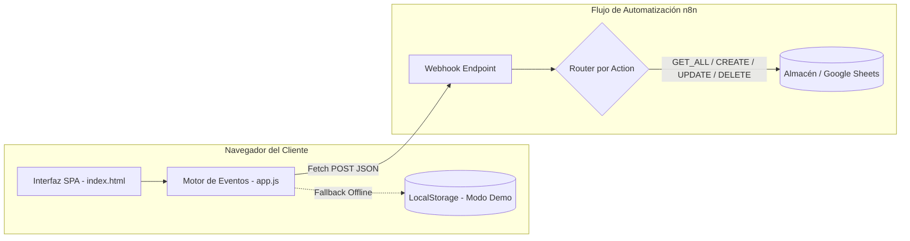

# ✈️ AeroReserva — Sistema de Gestión y Reserva de Vuelos

AeroReserva es una aplicación web moderna (SPA) diseñada para la gestión integral de reservas de vuelos comerciales. Integra una interfaz de usuario interactiva y responsiva con un motor de backend serverless orquestado mediante **Webhooks de n8n**, complementado con un **Modo Demostración / Offline** para evaluación local resiliente.


---

## 📌 Tabla de Contenidos

1. [Descripción General](#-descripción-general)
2. [Características Principales](#-características-principales)
3. [Arquitectura del Sistema](#-arquitectura-del-sistema)
4. [Estructura del Proyecto](#-estructura-del-proyecto)
5. [Contrato de la API (Payloads n8n)](#-contrato-de-la-api-payloads-n8n)
6. [Instalación y Uso](#-instalación-y-uso)
7. [Modo Demostración / Offline](#-modo-demostración--offline)
8. [Decisiones Técnicas](#-decisiones-técnicas)
9. [Seguridad](#-seguridad)
10. [Autor](#-autor)

---

## 📖 Descripción General

AeroReserva resuelve la necesidad de una plataforma ágil y ligera para que pasajeros y operadores gestionen itinerarios de vuelo sin sobrecargas de frameworks pesados. Combina maquetación fluida con validaciones en tiempo real y persistencia automatizada en flujos de n8n.

---

## 🔥 Características Principales

- 🛫 **Gestión Completa de Reservas (CRUD)**: Creación, lectura, actualización y cancelación con confirmación modal.
- ⚡ **Integración con n8n via Webhooks**: Comunicación HTTP POST con acciones parametrizadas (`action`: `GET_ALL`, `CREATE`, `UPDATE`, `DELETE`).
- 🟢 **Modo Demostración Local (Resiliencia en Entrevistas)**: Permite alternar con un clic hacia persistencia en `LocalStorage` con datos de prueba integrados, garantizando operatividad continua incluso si el webhook en la nube está inactivo.
- 🛡️ **Prevención Activa de XSS**: Sanitización de entradas mediante codificación de entidades HTML (`escHtml`).
- 🎨 **Experiencia de Usuario Premium**:
  - *Skeleton Loaders* durante la carga de peticiones de red.
  - Notificaciones *Toast* desacopladas y no intrusivas.
  - Indicador visual de estado de conexión (`Conectado`, `Offline`, `Modo Demo`).
  - Formulario dinámico con soporte para vuelos de solo ida o ida y vuelta.

---

## 🏗️ Arquitectura del Sistema



---

## 📂 Estructura del Proyecto

```text
AeroReservas/
├── index.html        # Estructura semántica, accesibilidad y modales
├── style.css         # Sistema de diseño con variables CSS y responsive design (+1500 líneas)
├── app.js            # Lógica de negocio, validaciones, cliente API y Modo Demo
├── json.json         # Definición completa del workflow exportado de n8n
├── .gitignore        # Control de versiones limpio
└── README.md         # Documentación técnica
```

---

## 📡 Contrato de la API (Payloads n8n)

Todas las peticiones se realizan mediante **HTTP POST** con `Content-Type: application/json`:

| Acción | Body de Envío | Propósito |
| :--- | :--- | :--- |
| `GET_ALL` | `{"action": "GET_ALL"}` | Obtener lista completa de reservas activas |
| `CREATE` | `{"action": "CREATE", "nombre": "...", "correo": "...", ...}` | Registrar una nueva reserva |
| `UPDATE` | `{"action": "UPDATE", "id": "...", ...}` | Actualizar datos de una reserva existente |
| `DELETE` | `{"action": "DELETE", "id": "..."}` | Cancelar/eliminar una reserva |

---

## 🚀 Instalación y Uso

### 1. Clonar el repositorio
```bash
git clone https://github.com/GabrielaRincon06/AeroReservas.git
cd AeroReservas
```

### 2. Ejecutar localmente
No requiere instalación de dependencias ni compilación. Puedes abrir directamente `index.html` en tu navegador o usar un servidor local ligero:
```bash
# Con VS Code: Clic derecho en index.html -> "Open with Live Server"
# O con Python:
python -m http.server 8080
```

---

## 🛠️ Modo Demostración / Offline

Para evaluar la aplicación sin necesidad de configurar una instancia de n8n:
1. Haz clic en el botón **"Modo Demo"** en la barra de navegación superior.
2. El indicador cambiará a `🟢 Modo Demo (Local)`.
3. Podrás registrar nuevos vuelos, editarlos y eliminarlos; los cambios se mantendrán almacenados en el `LocalStorage` de tu navegador.

---

## 💡 Decisiones Técnicas

- **JavaScript Vanilla vs Framework:** Se optó por JavaScript nativo para maximizar la velocidad de carga, evitar dependencias externas y demostrar dominio profundo del DOM y la API `fetch`.
- **Desacoplamiento de la URL del Webhook:** La URL del webhook se puede reconfigurar interactivamente en pantalla haciendo clic sobre el indicador de estado, guardándose en `localStorage` para evitar hardcoding en despliegues.

---

## 🛡️ Seguridad

- Todos los valores suministrados por el usuario son validados con expresiones regulares antes del envío y procesados mediante la función de escape `escHtml()` para mitigar inyecciones XSS.
- No se exponen credenciales de autenticación privadas en el código cliente.

---

## 👩‍💻 Autor

- **Maria Gabriela Rincón León** — Ingeniera Mecatrónica | Desarrolladora de Software
- **GitHub:** [@GabrielaRincon06](https://github.com/GabrielaRincon06)
- **Email:** [mgrl27061@gmail.com](mailto:mgrl27061@gmail.com)
